# Bill Cipher is watching you

A-X-O-L-O-T-L! My time has come to burn! I invoke the ancient power that I may return!

## Screenshots
### Pebble Classic/Steel
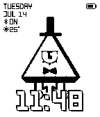

### Pebble 2/Duo
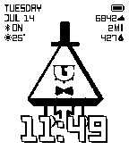

### Pebble Time/Time Steel
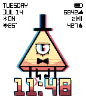
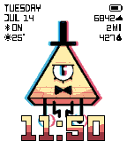
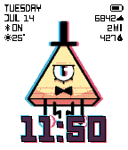
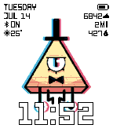

### Pebble Time Round
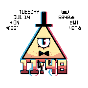
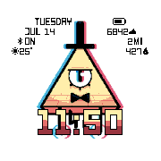
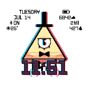
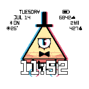

### Pebble Time 2
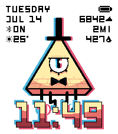
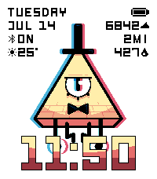
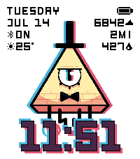
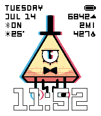

### Pebble Time Round 2
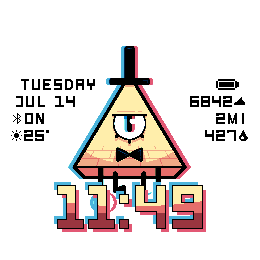
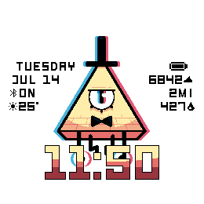
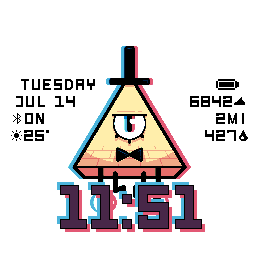
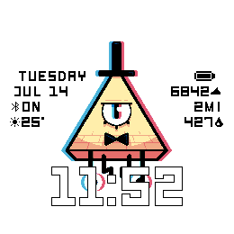

## Store
[Rebble App Store](https://apps.rebble.io/en_US/application/)
[Pebble App Store](https://apps.repebble.com/)

## Configuration Options

Open the watchface settings on your phone to customize:

### Time Color *(color watches only)*
- **Anaglyph** *(default)* — 3D-style time with cyan/magenta shadow offsets
- **Anaglyph (Flat)** — anaglyph shadows with a flat fill
- **Colorful** — yellow/orange/red gradient
- **Flat** — single color, picked with the **Flat Color** option below

### Flat Color *(color watches only)*
Color used by the Flat time style. Default: white.

### Temperature Units
Celsius (default) or Fahrenheit for the weather module.

### Animation on flick
Play the hover animation on wrist flick. If off, it only plays when the watchface loads.

### Left Side / Right Side
Five configurable lines per side. Each line can show one of:

| Module | Notes |
|---|---|
| None | Line collapses, no gap left behind |
| Day of Week | e.g. `TUESDAY` |
| Date | e.g. `JUL 14` |
| Battery | Battery level icon |
| Bluetooth | Connection status (`ON`/`OFF`) |
| Weather | Temperature + condition icon (updates every 30 min) |
| Steps | Today's step count *(not on Pebble Classic/Steel)* |
| Distance | Today's distance in km/mi *(not on Pebble Classic/Steel)* |
| Calories | Today's active calories *(not on Pebble Classic/Steel)* |
| Year | Current year |
| Heart Rate | Current BPM *(watches with HR sensor only)* |

Defaults — left: Day of Week, Date, Bluetooth, Weather; right: Battery, Steps, Distance, Calories.

## Support
For issues, questions, or suggestions, please open an issue on GitHub.

## License
MIT License - feel free to modify and share!